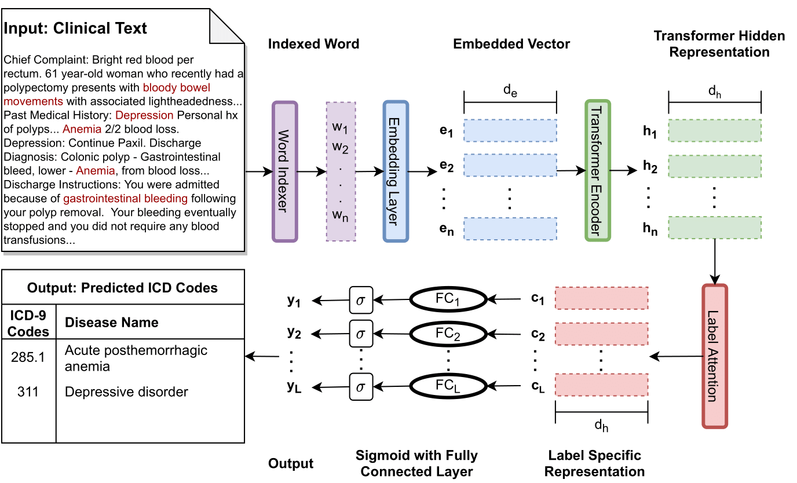
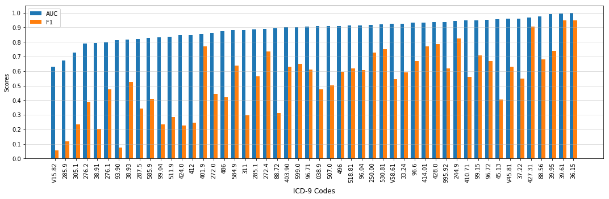
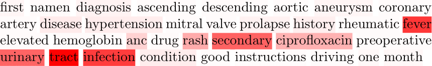
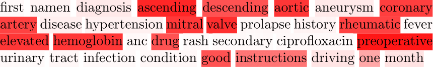

# TransICD: Transformer Based Code-wise Attention Model for Explainable ICD Coding

This repository contains the official PyTorch implementation of the following paper:

> **TransICD: Transformer Based Code-wise Attention Model for Explainable ICD Coding**<br>
> Biplob Biswas, Hoang Pham, Ping Zhang<br>
> [paper](Paper pdf link)
>
> **Abstract:** *International Classification of Disease (ICD) coding procedure which refers to tagging medical notes with diagnosis codes has been shown to be effective and crucial to the billing system in medical sector. Currently, ICD codes are assigned to a note manually which is likely to cause many errors. Moreover, training skilled coders also requires time and human resources. Therefore, automating the determination of ICD codes is an important task. With the advancement of artificial intelligence theory and computational hardware, machine learning approach has emerged as a suitable solution to automate this process. In this project, we apply a transformer-based architecture to capture the interdependence among the tokens of a document and then use a code-wise attention mechanism to learn code-specific representations of the entire document. Finally, they are fed to separate dense layers for corresponding code prediction. Furthermore, to handle the imbalance in the code frequency of clinical datasets, we employ a label distribution aware margin (LDAM) loss function. The experimental results on the MIMIC-III dataset show that our proposed model outperforms other baselines by a significant margin. In particular, our best setting achieves a micro-AUC score of 0.923 compared to 0.868 of bidirectional recurrent neural network. We also show that by using code-wise attention mechanism, our proposed model can provide more insights about its prediction, and thus it can support clinicians to make reliable decisions.*

# Framework 

TransICD takes patients' discharge note from hospital as input, computes hidden representation of its tokens' using transformer encoder, then use code-wise attention to project entire note to latent space and finally use dense layer to predicts ICD codes associated to the note as output.



# Files Directory
    TransICd/
    |
    |--code/
    |
    |--img/
    |
    |--results/                              * Results and log files will be generated here                                  
    |
    |--mimicdata/                            * Put the downloaded MIMIC-III dataset here.
         |                                  
         |--NOTEEVENTS.csv                   * Collect from MIMIC-III.
         |
         |--DIAGNOSES_ICD.csv                * Collect from MIMIC-III.
         |
         |--PROCEDURES_ICD.csv               * Collect from MIMIC-III.
         |
         |--D_ICD_DIAGNOSES.csv              * Collect from MIMIC-III.
         |
         |--D_ICD_PROCEDURES.csv             * Collect from MIMIC-III.
         |
         |--ICD9_descriptions (Already given)
         |
         |--caml/                            * train-dev-test split (already given) from [caml-mimic](https://github.com/jamesmullenbach/caml-mimic)
         |    |
         |    |--train_50_hadm_ids.csv
         |    |
         |    |--dev_50_hadm_ids.csv
         |    |
         |    |--test_50_hadm_ids.csv
         |    |
         |    |--train_full_hadm_ids.csv
         |    |
         |    |--dev_full_hadm_ids.csv
         |    |
         |    |--test_full_hadm_ids.csv
         |
         |--generated/                       * The preprocessing codes will generate some files here.


# Environment
Ubuntu20.04, python3.7.6

Install [pytorch 1.5.0](https://pytorch.org/)

# Data preprocessing

## MIMIC-III data preprocessing
1. Download [MIMIC-III](https://mimic.physionet.org) dataset and put the required files (specified above in the file tree) in transICD/mimicdata/.

2. Preprocess MIMIC-III data.
```
cd code/
python preprocessor.py
```

# TransICD

1. Train TransICD model.
```
cd code/
python main.py
```

## Hyper-paramers of TransICD

|Hyper-Parameter                   |Value       |    
|----------------------------------|------------|
|Maximum document Length           |    2500    |
|Embed Size (d_e)                  |     128    |
|No. of Transformer Encoder Layer  |       2    |
|No. of Transformer Attention Head |       8    |
|Hidden Size (d_h)                 |     128    |
|Learning Rate                     |   0.001    |
|Batch Size                        |       8    |
|Dropout Rate                      |     0.1    |
|Epochs                            |      30    |


## Results of TransICD

The comparative scores of different models for the 50 most frequent ICD codes of MIMIC-III dataset. Our proposed TransICD model produced highest scores on micro F1 and on both macro and micro AUC, whereas the result in macro-F1 and precision@5 are comparable to the corresponding best score.

```
--------------------------------------------------------------------------------------------------
|                                               |        AUC        |         F1        |        |
|Model                                          |---------|---------|---------|---------|   P@5  |
|                                               |  Macro  |  Micro  |  Macro  |  Micro  |        |
|-----------------------------------------------|------------------------------------------------|
|LR                                             |  82.9      86.4      47.7      53.3      54.6  |
|Bi-GRU                                         |  82.8      86.8      48.4      54.9      59.1  |
|C-MemNN                                        |  83.3       -         -         -        42.0  |
|C-LSTM-Att                                     |   -        90.0       -        53.2       -    |
|CNN                                            |  87.6      90.7      57.6      62.5      62.0  |
|CAML                                           |  87.5      90.9      53.2      61.4      60.9  |
|LEAM                                           |  88.1      91.2      54.0      61.9      61.2  |
|-----------------------------------------------|------------------------------------------------|
|Transformer                                    |  85.2      88.9      47.8      56.3      56.5  |
|Transformer + Attention                        |  88.2      91.1      49.4      59.3      59.6  |
|TransICD (Transformer + Attention + LDAM_loss) |  89.4&pm;0.1      92.3&pm;0.1      56.2&pm;0.4     64.4&pm;0.3      61.7&pm;0.3  |
--------------------------------------------------------------------------------------------------
```

AUC and F1 scores across top-50 frequent ICD-9 codes of MIMIC-III dataset:




## Visualization
Visualization of the model attending on an excerpt from a discharge summary for label- (a) Urinary tract infection (ICD: 599.0), (b) Single internal mammary-coronary artery bypass (ICD: 36.15). Darker color indicates higher attention:

(a)


(b)



